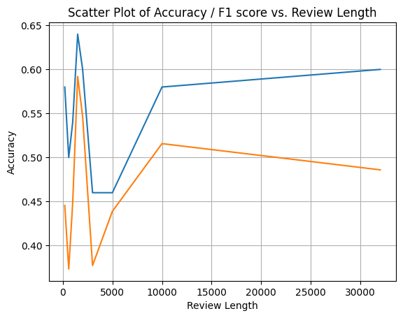

## Running this repo

Chose your favourite Python environment management system to make an environment (I like pyenv)

```bash
pyenv virtualenv 3.12 sentiment
pyenv activate sentiment
python -m pip install .
```

Problems with VSCode not using the correct environment when running the notebook can be resolved with 

```bash
python -m ipykernel install --user --name=sentiment
```

I probably wouldn't try and run the whole notebook as some of the cells are quite long running. 

## Selecting data 

The dataset has 40k entries. In the end I only ever used 50 of them (more on that later), but in order to subsample I did the following:

- Checked the language of all the reviews was English using `langdetect` (it was)
- Got a handle on the length (in terms of characters) of the reviews 
- There was no other data about the type of film etc. easily accessible
- I could've done something with readbility metrics but it felt like overkill to be honest for chosing a sample of a dataset 
- I stratifed on label + binned review length

## The models 

Llama by default loads the models with a 512 context window. After a bit of experimenting I turned that off as this was way shorter than the average review length.

(NB I just had the though that n_ctx might be token length not character length... oops).

Interacting with the model in any amount of time proved quite frustrating. There was no way to call the model in batch mode and any sort of concurrency I couldn't get to work without crashing the kernel, exceptions or simply not working. It took about 3s to run an example on both the big model and the small one which was a bit of an annoying constraint. 

## Hyperparameters 

In this task we are NOT looking for diversity in output, we want either a float score [-1, 1] or a binary (0, 1). 

Given this:

- `top_k` limits model's output to most likely words (larger k = more diversity). Thus we want a lower k 
- `top_p` dynamically adjusts #tokens considered based on a cumulative probability. p in [0, 1]. We want a higher p 
- Not recommended to adjust both `top_p` and temperature so let's leave temperature at the default

I ran a small bit of hyperparameter tuning on 3x different `top_k` values and 3x different `top_p` values. I forgot to sample the data properly (I just took the head of the top of the subset) but with 30 examples this hyperparameter optimisation took 40 mins so there was no rerunning it. 

Based on the accuracy and f1 scores I ended up with:

| Model | `top_k` | `top_p` |
| - | - | - | 
| small | 20 | 0.9 |
| big | 40 | 0.9 | 

## Metrics 

Given this was a binary classification (and I wasn't producing much data) there didn't seem much point in looking far beyond accuracy (as per the instructions) and F1 score (geometric mean of precision & recall) so I stuck with those two. 

## Prompt crafting adventures

All of these were run on 50 (!) examples. 

### Baseline

I had a very basic baseline prompt that I did the `top_k` and `top_p` analysis with:

```python
system_prompt_baseline = "You are doing sentiment analysis on movie reviews. Classify the review as positive (0) or negative (1)."
```

I chose this because it's nearly impossible to make this any shorter so would probably be easy to improve on (!) The small model was worse than random (accuracy = 0.5) for this, while for the bigger model it was a little better than random (accuracy = 0.57). 

### Extended

Extending the prompt a little to add a bit more guidance was a natural next step: 

```python
system_prompt_extended = "You are doing sentiment analysis on movie reviews. Classify the review as positive (0) or negative (1). Only return a 0 or a 1. Here is the movie review to analyse:"
```

This made the small model WORSE (I suspected prompt length might be an issue with the unconstrained context length) but the bigger model marginally better. 

### Return a float value

The next idea was to try and get the model to return a float instead of a binary:

```python
system_prompt_float = """
You are doing sentiment analysis on movie reviews. 
Classify the sentiment of the review as a float between -1 (most negative) and 1 (most positive). 
Do not return anything else apart from this float. 
Here is the movie review to classify:"""
```

This turned out to be a terrible idea that reduced the accuracy from both models. 

### Few shot

I then tried a few-shot prompt, with some simple examples (I did also try this with the float output but it didn't help):

```python
system_prompt_few_shot = """
You are doing sentiment analysis on movie reviews. 
Classify the review as positive (0) or negative (1). 
Only return a 0 or a 1. 
Here are some examples: 
1. "This movie was absolutely terrible in every way possible!" (negative: 1)
2. "I really enjoyed the plot and the characters were amazing." (positive: 0)
3. "The acting was subpar but the movie was still enjoyable." (slightly negative: 1)

Here is the movie review to analyse:"""
```

This was also distinctly worse than the baseline. 

### Review length

At this point the large model is only beating random chance for `system_prompt_extended` (and the small model never is). I wondered if the length of the prompt (both system prompt and review) is to blame?

Few ways to reduce length of review:

- Take last `n` tokens from the review (as people might finish with a conclusion?)
- Take first `n` tokens from the review 
- Take random window of `n` tokens from the review 
- Only keep "important" words (ditching works with not sentiment attached like `the` etc.)

Given everything takes so long to run I am just going to do a simple experiment with review length for (a) the big model and (b) the first of these ideas. I will stick with the `system_prompt_extended` prompt as the best of the previous prompts.



The last datapoint of this graph is the original "no limits" context length that the model was originally running with. (Character) length of 1500 clearly wins here. The latter datapoints (i.e. char lengths > 5k) will be a bit unreliable due to small numbers (there may also be an effect -- not studied -- where longer reviews are easier to classify)

### Results

| prompt                                      | accuracy | f1_score | model_size | 
|---------------------------------------------|----------|----------|------------|
| system_prompt_baseline                      | 0.400000 :sparkles: | 0.273171 :sparkles: | small      | 
| system_prompt_extended                      | 0.320000 | 0.213333 | small      |
| system_prompt_float                         | 0.180000 | 0.272432 | small      |
| system_prompt_few_shot                      | 0.400000 | 0.251429 | small      |
| system_prompt_baseline                      | 0.566667 | 0.441481 | big        |
| system_prompt_extended                      | 0.600000 | 0.485965 | big        |
| system_prompt_float                         | 0.000000 | 0.000000 | big        |
| system_prompt_few_shot                      | 0.260000 | 0.262261 | big        |
| system_prompt_extended + review_length 200  | 0.580000 | 0.445534 | big        |
| system_prompt_extended + review_length 600  | 0.500000 | 0.373333 | big        |
| system_prompt_extended + review_length 1000 | 0.540000 | 0.448747 | big        |
| system_prompt_extended + review_length 1500 | 0.640000 :sparkles: | 0.592000 :sparkles: | big        |
| system_prompt_extended + review_length 2000 | 0.600000 | 0.546667 | big        |
| system_prompt_extended + review_length 3000 | 0.460000 | 0.377387 | big        |
| system_prompt_extended + review_length 5000 | 0.460000 | 0.438919 | big        |
| system_prompt_extended + review_length 10000| 0.580000 | 0.515746 | big        |

## Other stuff I could've done

- Been much more clever in terms of tokens instead of characters
- There was a lot more low hanging fruit in terms of review length being passed
   - where the sample was taken from in the review 
   - removing "sentiment-free" words 
- Investigate length of review vs ease of classification 
- Tried a multi-turn loop where there was a summarisation step ("e.g. pick out all the words that have semantic meaning")
- I didn't try anything remotely different between small + large models here, largely because I didn't really get to the point of having satisfactory results for the large model to try and match 
- An interesting thing noted but not investigated / mitigated for was the fact the smaller model tended positive sentiment detected, while the larger model was the opposite. 
- Done this in a codespace to give my laptop less of a hard time and speed up the iteration loop :skull:
